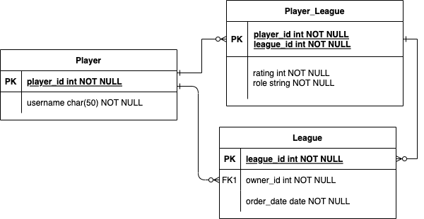

# Ranking api
## Development: 
### Requirements
Requires postgres, [stack](https://docs.haskellstack.org/en/stable/) and [docker](https://www.docker.com/)
### Building, running and testing
NOTE: zsh which is default on newer macos is not supported with stack, requires bash shell.

Start database using `docker-compose.yml` by running `docker-compose up -d` 

```
stack build
```

builds the application
then run 

```
stack exec ranking-api-exe
```
 to run application

```
stack test
```
to test

```
stack clean
```
to clean local compiler output

### Adding dependencies:
add it under dependencies in package.yml, then run 
```
stack build
```

## Entity relations (preliminary)
